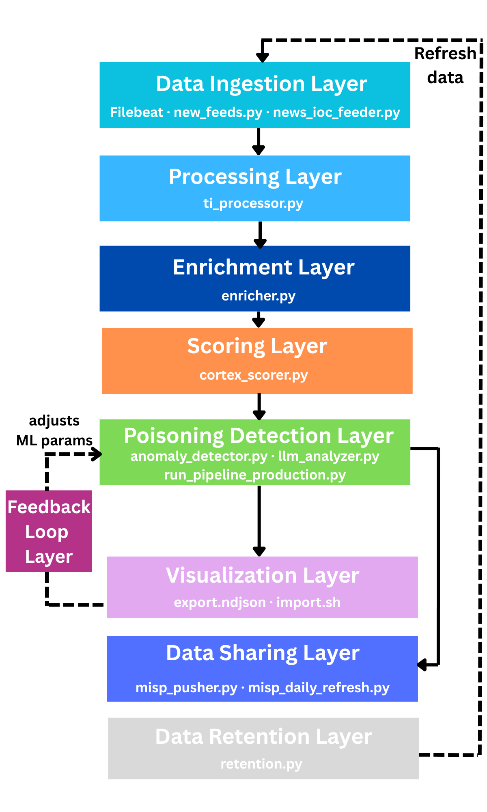

# ThreatRadar

An end-to-end Threat Intelligence pipeline with AI-powered feed poisoning detection, Cortex-driven IOC scoring, and MISP integration.

[](LICENSE)
[](https://www.python.org/)
[](https://www.elastic.co/)
[](https://www.elastic.co/kibana)
[](https://www.elastic.co/beats/filebeat)
[](https://www.docker.com/)
[](https://github.com/TheHive-Project/Cortex)
[](https://www.misp-project.org/)
[](https://medium.com/@your-article-link)
---

## Table of Contents

- [Overview](#overview)
- [Pipeline Architecture](#pipeline-architecture)
- [Features](#features)
- [Technology Stack](#technology-stack)
- [Prerequisites](#prerequisites)
- [Full Installation Guide](#full-installation-guide)
- [Configuration](#configuration)
  - [Environment Variables](#environment-variables)
  - [Cortex Analyzer](#cortex-analyzer)
  - [Threat Intelligence Feeds](#threat-intelligence-feeds)
  - [ML Poisoning Detection](#ml-poisoning-detection)
  - [MISP Integration](#misp-integration)
- [Running ThreatRadar](#running-threatradar)
- [Docker Deployment](#docker-deployment)
- [Kibana Dashboards](#kibana-dashboards)
- [Troubleshooting](#troubleshooting)
- [Contributing](#contributing)
- [License and Credits](#license-and-credits)

---

## Overview

ThreatRadar is an open-source Threat Intelligence (TI) pipeline designed for Security Operations Centers and threat intelligence teams. It aggregates IOCs from multiple sources, enriches and scores them through Cortex analyzers, and detects statistical anomalies and semantic contradictions in feed data using an LLM and IsolationForest model before results reach analyst queues.

A core design goal is addressing **feed poisoning**: the injection of false or misleading IOCs into threat intelligence feeds to manipulate defender decisions. ThreatRadar handles this at the pipeline level through AI detection and closed-loop feedback from analyst sightings in MISP.

**What ThreatRadar does:**

- Ingests IOCs from multiple open and commercial feeds
- Normalizes and classifies IOCs into seven typed Elasticsearch indices
- Enriches each IOC with MITRE ATT&CK mappings, CVSS scores, and actor attribution
- Scores IOCs via Cortex analyzers (VirusTotal, AbuseIPDB, Maltiverse, IPinfo, Urlscan, HybridAnalysis)
- Flags statistically anomalous IOCs using a trained IsolationForest model and an LLM that semantically validates IOCs against 8 contradiction classes (APT-sector mismatches, malware incompatibilities, implausible combinations, etc.) to determine if the intelligence is safe or poisoned.


- Pushes validated, enriched IOCs to MISP with TLP tagging and distribution controls
- Retrains the anomaly model using analyst sightings as a feedback signal

> **Read the full project write-up on Medium:** [Designing and Implementing THREATRADAR: An Open-Source Feed-Based Threat Intelligence Pipeline](https://medium.com/@salmactf/designing-and-implementing-threatradar-an-open-source-feed-based-threat-intelligence-pipeline-73d568da8f27)

---

## Pipeline Architecture

ThreatRadar runs as a set of Docker microservices organized into nine sequential stages:



---

## Features

- **Multi-source feed ingestion**: NVD, OTX, AbuseIPDB, EmergingThreats, SSL Blacklist, and security news RSS feeds included out of the box. Custom sources can be added without modifying core logic.
- **Seven IOC type classifications**: IP addresses, URLs, file hashes, domains, CVEs, ransomware families, and cryptocurrency wallets, each routed to type-appropriate analyzers.
- **Cortex analyzer integration**: Automated IOC interrogation across six intelligence services, producing normalized composite scores with severity tiers (CRITICAL / HIGH / MEDIUM / LOW) and recommended actions.
- **ML anomaly detection & LLM semantic validation**: A scikit-learn IsolationForest model with calibrated contamination scoring flags statistically unusual IOCs before they enter analyst queues.
   Flagged IOCs then undergo LLM semantic analysis (OpenAI GPT-4o via OpenRouter) that validates intelligence against 8 contradiction classes, checking for APT-sector mismatches, malware, incompatibilities, and  implausible threat combinations to determine if intelligence is COHERENT, SUSPICIOUS, or CONTRADICTED.
- **Feedback-driven retraining**: MISP sightings and analyst confirmations trigger incremental model retraining with configurable signal thresholds and cooldown periods.
- **Automated MISP publication**: Enriched IOCs are bulk-pushed to MISP with TLP classification, corroboration distribution tags, and configurable worker concurrency.
- **Kibana dashboards**: Pre-built dashboards for feed coverage, IOC scoring distributions, poisoning alerts, and pipeline throughput.
- **Fully containerized**: Nine Docker services with health checks, declared inter-service dependencies, and a shared named network.
- **No hardcoded credentials**: All secrets are injected via environment variables. The `.gitignore` excludes `.env` by default.


---

## Technology Stack

| Layer | Technology | Version | Role |
|---|---|---|---|
| Search and Storage | Elasticsearch | 9.3.0 | Primary IOC store across 7 typed indices |
| Visualization | Kibana | 9.3.0 | Dashboards and index management |
| Log Shipping | Filebeat | 9.3.0 | Structured log and feed ingestion |
| IOC Analysis | Cortex (TheHive Project) | latest | Analyzer orchestration engine |
| Threat Sharing | MISP | latest | Community threat sharing platform |
| Database | MySQL | 8.0 | MISP backend relational store |
| Cache and Queue | Redis | 7 | MISP session and queue management |
| Runtime | Python | 3.11+ | All pipeline scripts |
| ML | scikit-learn | ≥ 1.2.0 | IsolationForest anomaly detection |
| LLM & Semantic Analysis | OpenRouter(GPT-4o) | latest | Semantic contradiction detection for poisoned threat intelligence |
| Data Processing | pandas / numpy | ≥ 2.0 / ≥ 1.24 | Feature engineering and data wrangling |
| MISP Client | PyMISP | ≥ 2.4.170 | Programmatic MISP interaction |
| Elasticsearch Client | elasticsearch-py | ≥ 9.0 | Elasticsearch bulk operations |
| Model Persistence | joblib | ≥ 1.3.0 | IsolationForest model serialization (`.pkl`) |
| Reporting | ReportLab | ≥ 4.0.0 | PDF report generation |
| Containerization | Docker + Compose | _ | Full stack orchestration |

### External Intelligence Services (via Cortex)

| Service | IOC Types |
|---|---|
| VirusTotal | IP, URL, Hash, Domain |
| AbuseIPDB | IP |
| Maltiverse | IP, URL, Hash, Domain |
| IPinfo | IP |
| Urlscan.io | URL, Hash, Domain |
| HybridAnalysis | URL, Domain |

---

## Prerequisites

### System Requirements

| Resource | Minimum | Recommended |
|---|---|---|
| OS | Ubuntu 22.04 LTS, macOS | Ubuntu 22.04 LTS |
| RAM | 8 GB | 16 GB |
| Disk | 20 GB free | 50 GB free |
| CPU | 4 cores | 8 cores |

> Windows is supported via WSL2 only. Native Windows is not supported.

### Required Software

```bash
python3 --version    # 3.11.x or 3.12.x required
docker --version     # 24.x or later
docker compose version  # v2.x required
git --version
```

### API Keys

| Service | Required | Where to obtain |
|---|---|---|
| Elasticsearch | Yes | Self-hosted : auto-configured by Docker |
| Cortex | Yes | Self-hosted: generate via Cortex UI after setup |
| NVD (NIST) | Yes | [nvd.nist.gov/developers/request-an-api-key](https://nvd.nist.gov/developers/request-an-api-key) |
| AbuseIPDB | Yes | [abuseipdb.com/account/api](https://www.abuseipdb.com/account/api) |
| AlienVault OTX | Yes | [otx.alienvault.com](https://otx.alienvault.com) → API Keys |
| MISP | Yes| Self-hosted via the included Docker stack |
| OpenRouter | Yes | [openrouter.ai/keys](https://openrouter.ai/keys) → New Key |


> **Security note:** Never commit `.env` files to version control. The repository's `.gitignore` excludes `.env` by default, but verify this before pushing.

---

## Full Installation Guide

### Step 1: Clone the Repository

```bash
git clone https://github.com/THREATRADAR-Pipeline/ThreatRadar.git
cd ThreatRadar
```

Repository layout:

```
ThreatRadar/
├── elasticsearch/                    # Main pipeline
│   ├── data_ingestion/               # Filebeat config and Python feeders
│   ├── data_normalization/           # IOC type classification and deduplication
│   ├── data_enrichment/              # MITRE, CVSS enrichment
│   ├── data_retention/               # Index lifecycle management
│   ├── scoring/                      # Cortex scorer
│   ├── poisoning_detection/          # ML anomaly detection
│   │   ├── models/                   # IsolationForest and scaler artifacts (.pkl)
│   │   ├── pipeline/                 # Production runner
│   │   └── feedback/                 # MISP feedback loop and retrainer
│   ├── kibana/                       # Dashboard export and import script
│   ├── cortex/                       # Cortex application config
│   ├── docker-compose.yml
│   └── Dockerfile
├── misp/                             # MISP threat sharing stack
│   ├── docker-compose.yml
│   ├── Dockerfile
│   ├── misp_pusher.py
│   ├── misp_helpers.py
│   └── misp_daily_refresh.py
├── common.py                         # Shared index and field name constants
└── LICENSE
```

### Step 2: Set Up a Python Virtual Environment

Required only for local development or running scripts outside Docker:

```bash
python3 -m venv venv
source venv/bin/activate

pip install -r elasticsearch/requirements.txt
pip install -r elasticsearch/poisoning_detection/requirements.txt
pip install -r misp/requirements.txt
```

### Step 3: Configure Environment Files

```bash
cp elasticsearch/.env.example elasticsearch/.env
cp misp/.env.example misp/.env         
```

See [Environment Variables](#environment-variables) for a complete reference.

### Step 4: Configure Cortex

```bash
cp elasticsearch/cortex/application.conf.example elasticsearch/cortex/application.conf
```

See [Cortex Analyzer](#cortex-analyzer) for configuration details.

### Step 5: Create the Shared Docker Network

Both the main pipeline and the MISP stack communicate over a named external Docker network. Create it before starting the Compose stack:

```bash
docker network create soc-net
```

Both `docker-compose.yml` files reference this network as `soc-net` with `external: true`. Starting a stack without this network will cause all containers to fail.

### Step 6: Launch the Pipeline

```bash
cd elasticsearch
docker compose up -d
```

Services start in dependency order:

| Container | Role | Port |
|---|---|---|
| `elasticsearch` | Elasticsearch 9.3.0 | 9200 |
| `kibana` | Kibana 9.3.0 | 5601 |
| `filebeat` | feed shipper | — |
| `cortex` | Cortex analyzer engine | 9001 |
| `pipeline` | Ingestion, normalization, enrichment | — |
| `scorer` | Cortex IOC scorer (7 parallel workers) | — |
| `poisoning_detection` | IsolationForest anomaly detection (runs every 24 h) | — |
| `feedback_loop` | MISP feedback and model retraining (runs every 30 min) | — |

### Step 7: Import Kibana Dashboards

Wait for Kibana to report healthy, then run:

```bash
bash elasticsearch/kibana/import.sh
```

This loads `kibana/dashboards/export.ndjson`. Dashboards are accessible at `http://localhost:5601`.

### Step 8: Launch MISP

```bash
cd misp
docker compose up -d
```

MISP will be available at `https://localhost:8443`. Initial database setup can take several minutes.

---

## Configuration

### Environment Variables

All configuration for the main pipeline lives in `elasticsearch/.env`.

#### Elasticsearch and Security

```dotenv
ELASTIC_HOST=http://elasticsearch:9200
ELASTIC_USER=elastic
ELASTIC_PASSWORD=<strong_password>

KIBANA_SYSTEM_PASSWORD=<kibana_system_password>
KIBANA_SERVICE_TOKEN=<auto-generated — see note>
```

> `KIBANA_SERVICE_TOKEN` is generated by the Elasticsearch container on first boot and written to a shared tmpfs volume. You do not need to set this manually under normal circumstances. If Kibana fails to start, generate the token manually:
>
> ```bash
> docker exec elasticsearch elasticsearch-service-tokens create elastic/kibana kibana_token
> ```

#### API Keys for Threat Feeds

```dotenv
NVD_API_KEY=<nvd_api_key>
ABUSE_API_KEY=<abuseipdb_api_key>
OTX_API_KEY=<otx_api_key>
```

#### Cortex Integration

```dotenv
PLAY_SECRET_KEY=<random_string_minimum_32_characters>
CORTEX_API_KEY=<generated_from_cortex_ui>
CORTEX_URL=http://cortex:9001

SCORER_BATCH_SIZE=500        # IOCs processed per scoring batch
SCORER_IOC_WORKERS=4         # Concurrent workers per scorer instance
SCORER_POLL_INTERVAL=30      # Seconds between scorer polling cycles
```

#### Data Pipeline Scope

```dotenv
DATA_MODE=elasticsearch
ES_SOURCE_INDEX=ti_ip,ti_url,ti_domain,ti_hash,ti_cve,ti_wallet,ti_ransomware
MAX_DOCS=200000              # Maximum documents pulled per anomaly detection run
```

#### Anomaly Detection Thresholds

```dotenv
CONTAMINATION_MAX=0.03       # IsolationForest contamination parameter (range: 0.0–0.5)
ML_CONTAMINATION=0.02        # Contamination used during retraining runs
REPORT_MAX_DETAIL_IOCS=250   # Maximum IOCs included in detail section of PDF reports
OUTPUT_DIR=output            # Output directory for pipeline reports
```
#### OpenRouter LLM Configuration

```dotenv
OPENROUTER_API_KEY=<your_openrouter_api_key_here>
OPENROUTER_MODEL=openai/gpt-4o-mini
OPENROUTER_FALLBACK_MODELS=openai/gpt-4o-mini,meta-llama/llama-3.1-8b-instruct,anthropic/claude-3.5-sonnet
LLM_CALL_TIMEOUT=180
LLM_MAX=500
SKIP_LLM=false
```

#### Feedback Loop and Retraining

```dotenv
FEEDBACK_LOOP_SECONDS=1800              # Polling interval for MISP sightings (seconds)
FEEDBACK_RETRAIN_MIN_TOTAL_SIGNAL=200   # Minimum sightings required to trigger retraining
FEEDBACK_RETRAIN_COOLDOWN_SECONDS=21600 # Minimum seconds between consecutive retraining runs
FEEDBACK_RETRAIN_FRESH_DAYS=14          # Only use sightings from the last N days
FEEDBACK_BACKFILL_EVENT_ID=true         # Backfill MISP event IDs when pushing feedback

TRAIN_MIN_DOCS=50            # Minimum documents required for a training run to proceed
TRAIN_MIN_SIGHTINGS=2        # Minimum MISP sightings required to count as a positive label
TRAIN_MAX_DOCS=20000         # Maximum training set size (older documents are dropped first)
```

#### MISP Connection

```dotenv
MISP_URL=https://misp:443/
MISP_KEY=<misp_auth_key>
MISP_VERIFY_SSL=false
MISP_ENABLED=true
```

### Cortex Analyzer

Edit `elasticsearch/cortex/application.conf`:

```hocon
# Generate a strong secret: openssl rand -base64 32
play.http.secret.key = "CHANGE_ME_TO_A_STRONG_RANDOM_SECRET"

search {
  index    = cortex
  uri      = "http://elasticsearch:9200"
  user     = "elastic"
  password = "SAME_PASSWORD_AS_IN_ENV"
}

job {
  runner  = [docker]
  timeout = 30 minutes
}

docker {
  host       = "unix:///var/run/docker.sock"
  autoRemove = true
}

play.http.context = "/"
```

**After Cortex starts**, complete analyzer setup in the Cortex web UI at `http://localhost:9001`:

1. Create an organization.
2. Add a user with `read, analyze` roles and generate an API key.
3. Copy the API key into `CORTEX_API_KEY` in `elasticsearch/.env`.
4. Go to **Analyzers** and enable each of the following, entering the corresponding API key for each:
   - `VirusTotal_GetReport`
   - `AbuseIPDB`
   - `Maltiverse`
   - `IPinfo`
   - `Urlscan_Search`
   - `HybridAnalysis_GetReport`

The scorer maps analyzer names to internal Cortex IDs via the `ANALYZER_IDS` dictionary in `elasticsearch/scoring/cortex_scorer.py`. If your Cortex installation assigns different IDs (visible in the Cortex API at `GET /api/analyzer`), update the dictionary:

```python
ANALYZER_IDS: dict[str, str] = {
    "VirusTotal":     "4e0c593591c2d943509e6e3ccb359d23",
    "AbuseIPDB":      "316d8e2f7e446ecae6cbb3e77280584f",
    "Maltiverse":     "1f79ad8a0af87006bb6f094a27a87561",
    "IPinfo":         "050365fe333a9c7c5fb0a1928bb8f25b",
    "Urlscan":        "3eaf513a6e1abf7bf21fe1fae5bbd503",
    "HybridAnalysis": "ffc2eaee2d7c9a507e42752e81593103",
}
```

---

### Threat Intelligence Feeds

#### Built-in Feeds

| Feed | IOC Types | Source |
|---|---|---|
| NVD CVE Database | CVE | NIST NVD API |
| AlienVault OTX | Multiple | OTX API |
| AbuseIPDB | IP | AbuseIPDB API |
| EmergingThreats Compromised IPs | IP | Public URL |
| EmergingThreats Botnet C2 | IP | Public URL |
| SSL Blacklist (abuse.ch) | SSL/Hash | abuse.ch CSV |
| TheHackersNews | News/IOC | RSS |
| BleepingComputer | News/IOC | RSS |
| Cisco Talos Blog | News/IOC | RSS |
| Palo Alto Unit 42 | News/IOC | RSS |
| Kaspersky SecureList | News/IOC | RSS |

#### Adding Custom URL-Based Feeds

Append to the relevant list in `elasticsearch/data_ingestion/new_feeds.py`:

```python
# Plain IP blocklist
ET_FEEDS: list[dict[str, str]] = [
    {
        "url":  "https://your-feed.example.com/ips.txt",
        "name": "My Custom Feed",
        "tag":  "custom-blocklist",
    },
]

# News/blog RSS feed with IOC extraction
NEWS_FEEDS: list[dict[str, str]] = [
    {
        "url":  "https://your-blog.example.com/feed/",
        "name": "MySecBlog",
        "tag":  "news-myblog",
    },
]
```

For structured feeds (CSV, JSON, or API-based), follow the pattern of the `SSLBL_URL` handler in `new_feeds.py`, which demonstrates CSV parsing with IOC extraction.

For log-based or syslog feeds, configure `elasticsearch/data_ingestion/filebeat.yml` using the existing input configuration as a reference.

---

### ML Poisoning Detection

The IsolationForest model is pre-trained and stored as `.pkl` artifacts in `elasticsearch/poisoning_detection/models/`. Do not delete these files; if lost, trigger a manual retraining run (see [Running ThreatRadar](#running-threatradar)).

Key parameters are controlled via the environment variables documented in [Anomaly Detection Thresholds](#anomaly-detection-thresholds) above. The contamination parameters directly affect the false positive rate:

- `CONTAMINATION_MAX`: sets the expected proportion of outliers in the data at inference time. Lower values flag fewer IOCs as anomalous.
- `ML_CONTAMINATION`: used when retraining from MISP feedback. Should be tuned to reflect the actual proportion of poisoned IOCs observed in your environment.

---

### MISP Integration

Edit `misp/.env`:

```dotenv
# Elasticsearch (shared with main pipeline)
ELASTIC_HOST=http://elasticsearch:9200
ELASTIC_USER=elastic
ELASTIC_PASSWORD=<elastic_password>

# MISP API
MISP_URL=https://misp:443
MISP_KEY=<misp_auth_key>
MISP_VERIFY_SSL=False

# TLP and distribution
MISP_TLP_TAG=tlp:green
MISP_CLEAN_DISTRIBUTION=1          # Distribution level for clean IOCs (0–4, per MISP schema)
MISP_CORROBORATED_DIST=1           # Distribution for corroborated IOCs
MISP_CVE_EXPLOITED_DIST=1          # Distribution for exploited CVEs

# Performance
MISP_PUSH_WORKERS=12               # Parallel push workers
MISP_PUSH_DELAY=0.05               # Delay between push requests (seconds)
MISP_SEARCH_DELAY=0.02             # Delay between search requests (seconds)
MISP_BULK_FLUSH=500                # Documents per bulk flush operation

# Bootstrap credentials (used on first startup only)
MISP_ADMIN_EMAIL=admin@admin.test
MISP_ADMIN_PASSPHRASE=admin #misp default configuration
BASE_URL=https://misp:443
MISP_EXTERNAL_BASEURL=https://misp:443
ADMIN_KEY=<admin_key>

# MySQL backend
MYSQL_ROOT_PASSWORD=<strong_password>
MYSQL_DATABASE=misp
MYSQL_USER=misp
MYSQL_PASSWORD=<strong_password>

# Redis
REDIS_PASSWORD=<strong_password>
```

#### Configuring MISP for the Feedback Loop

The feedback daemon (`feedback_daemon.py`) uses MISP sightings tagged with `threatradar:analyst_confirmed=true` as the positive signal for model retraining. Without this tag, the feedback loop will run but accumulate no training signal.

**Step 1 — Create the analyst confirmation tag**

Log in to MISP (`https://localhost:8443`), then go to **Event Actions → Tags → Add Tag** and create the following tag:

```
threatradar:analyst_confirmed=true
```

Set the colour to something distinctive (e.g. `#e83030`) so the tag is easy to spot in the event view. Leave the taxonomy field blank.

**Step 2 — Apply the tag when confirming an IOC**

When an analyst reviews a ThreatRadar-pushed event and confirms the IOC is a genuine true positive, they must apply the `threatradar:analyst_confirmed=true` tag to the relevant MISP attribute. The feedback daemon polls for attributes carrying this tag every `FEEDBACK_LOOP_SECONDS` seconds (default: 1800) and counts them toward the `FEEDBACK_RETRAIN_MIN_TOTAL_SIGNAL` threshold.

**Step 3 — Verify the tag is visible to the API key**

The `MISP_KEY` configured in `elasticsearch/.env` must belong to a MISP user with at least **read** access to the events being tagged. If sightings are not being picked up, confirm the API user's role and organisation sharing group in the MISP admin panel.

**Step 4 — Check feedback loop logs**

```bash
docker compose logs -f feedback_loop
```

A healthy feedback loop produces log lines similar to:

```
[feedback] Polled MISP: 47 confirmed sightings found (threshold: 200)
[feedback] Cooldown active — next retrain eligible in 4h 12m
```

Once the signal threshold is crossed and the cooldown has elapsed, retraining is triggered automatically:

```
[feedback] Signal threshold reached (213 sightings). Launching retrain...
[retrain] Training complete. Model saved to poisoning_detection/models/isolation_forest.pkl
```

---

## Running ThreatRadar

### Starting the Full Stack

```bash
cd elasticsearch
docker compose up -d
```

### Monitoring Services

```bash
# All services
docker compose logs -f

# Specific service
docker compose logs -f scorer
docker compose logs -f poisoning_detection
docker compose logs -f feedback_loop

# Service status
docker compose ps
```

### Running the Scorer Manually

```bash
# Single batch — score pending IP IOCs
docker exec scorer python3 /app/cortex_scorer.py --ioc-type ip --limit 100

# Continuous loop mode (production)
docker exec scorer python3 /app/cortex_scorer.py --loop --ioc-type ip --workers 4 --limit 500

# Valid --ioc-type values: ip, url, hash, domain, cve, ransomware, wallet
```

### Running the Anomaly Detection Pipeline Manually

```bash
# Trigger immediately, bypassing the 24-hour sleep interval
docker exec poisoning_detection python3 /app/poisoning_detection/pipeline/run_pipeline_production.py
```

### Running Feed Updates Manually

```bash
docker exec pipeline python3 /app/data_ingestion/new_feeds.py
docker exec pipeline python3 /app/data_ingestion/news_ioc_feeder.py
```

### Running MISP Operations Manually

```bash
# Push enriched IOCs to MISP
docker exec pipeline python3 /misp/misp_pusher.py

# Run daily MISP refresh
docker exec pipeline python3 /misp/misp_daily_refresh.py
```

### Running Data Retention

```bash
docker exec pipeline python3 /app/data_retention/retention.py
```

---

## Docker Deployment

### Service Graph

The main `elasticsearch/docker-compose.yml` defines eight services across two networks (`elastic` internal, `soc-net` shared with the MISP stack):

```
soc-net (external)
    │
    ├── elasticsearch  ←→  kibana
    │       │
    │       ├── filebeat
    │       ├── cortex
    │       ├── pipeline          (ingestion, normalization, enrichment)
    │       ├── scorer            (7 parallel workers, one per IOC type)
    │       ├── ti-pipeline       (anomaly detection — every 24 h)
    │       └── ti-feedback       (MISP feedback loop — every 30 min)
```

### Scorer Worker Configuration

The scorer starts seven parallel processes, one per IOC type. Default concurrency values in `docker-compose.yml`:

```yaml
python3 /app/cortex_scorer.py --loop --workers 8 --limit 500 --ioc-type cve &
python3 /app/cortex_scorer.py --loop --workers 8 --limit 500 --ioc-type ransomware &
python3 /app/cortex_scorer.py --loop --workers 8 --limit 500 --ioc-type wallet &
python3 /app/cortex_scorer.py --loop --workers 2 --limit 30  --ioc-type ip &
python3 /app/cortex_scorer.py --loop --workers 2 --limit 30  --ioc-type url &
python3 /app/cortex_scorer.py --loop --workers 2 --limit 30  --ioc-type domain &
python3 /app/cortex_scorer.py --loop --workers 2 --limit 30  --ioc-type hash &
```

IP, URL, domain, and hash workers use lower concurrency because the corresponding Cortex analyzers (VirusTotal, AbuseIPDB) have stricter rate limits. Adjust `--workers` and `--limit` to match your analyzer API quotas.

### Rebuilding After Code Changes

```bash
# Rebuild a single service
docker compose up -d --build scorer

# Rebuild all services
docker compose up -d --build
```

### Stopping the Stack

```bash
# Stop services, preserve volumes
docker compose down

# Stop services and remove all volumes (destructive — deletes all indexed data)
docker compose down -v
```

### MISP Stack

The MISP stack is independent and can run on a separate host provided it is reachable on `soc-net`:

```bash
cd misp
docker compose up -d
# UI: https://localhost:8443
```

---

## Kibana Dashboards

Pre-built dashboards are in `elasticsearch/kibana/dashboards/export.ndjson`. Import with:

```bash
bash elasticsearch/kibana/import.sh
```

Included dashboards:

- **Feed coverage**: per-source IOC volume over time
- **IOC scoring distribution**: histogram of cortex scores across severity tiers
- **Poisoning alerts**: anomaly-flagged IOCs with score breakdowns
- **Pipeline health**: ingestion rate, scorer throughput, index sizes
- **IOC type breakdown**: relative volume across all seven IOC types

---

## Troubleshooting

| Symptom | Likely Cause | Resolution |
|---|---|---|
| Elasticsearch exits immediately | Insufficient JVM heap memory | Increase Docker memory limit to at least 4 GB. Adjust `ES_JAVA_OPTS=-Xms1g -Xmx1g` in `docker-compose.yml`. |
| Kibana shows "server is not ready" | Waiting for service token from Elasticsearch | Wait 2–3 minutes. If it persists, run: `docker exec elasticsearch elasticsearch-service-tokens create elastic/kibana kibana_token` |
| Cortex returns `401 Unauthorized` | Incorrect `CORTEX_API_KEY` | Regenerate the key in the Cortex UI under Organizations → API Keys. |
| Scorer logs "No pending IOCs found" | Ingestion pipeline has not run or produced no results | Run `docker logs pipeline` and verify indices exist: `curl -u elastic:$PASS http://localhost:9200/_cat/indices/ti_*?v` |
| MISP push fails with SSL error | Self-signed certificate | Set `MISP_VERIFY_SSL=False` in both `elasticsearch/.env` and `misp/.env`. |
| Feed ingestion returns no results | Invalid or rate-limited API key | Test each API key individually. NVD requires a registered key for sustained polling rates. |
| `soc-net` network not found | Network was not created before starting Compose | Run `docker network create soc-net`. |
| Retraining never triggers | Insufficient sightings signal | Lower `FEEDBACK_RETRAIN_MIN_TOTAL_SIGNAL` or allow more analyst sightings to accumulate in MISP. |
| Feedback loop finds zero sightings | `threatradar:analyst_confirmed=true` tag not applied or not visible to API key | Create the tag in MISP (Event Actions → Tags) and confirm the `MISP_KEY` user can read the tagged events. |
| `docker.sock` permission denied in Cortex | Docker socket not mounted | Confirm `- /var/run/docker.sock:/var/run/docker.sock` is present under the `cortex` service volumes in `docker-compose.yml`. |
| IsolationForest model not found | `.pkl` files deleted from `models/` | Trigger a manual retraining run: `docker exec poisoning_detection python3 /app/poisoning_detection/pipeline/run_pipeline_production.py` |
| Retention job deletes too aggressively | Thresholds set too low | Increase `RETENTION_*_DAYS` values in `elasticsearch/.env` and restart the pipeline container. |

### Checking Index Health

```bash
# List all TI indices with document counts and sizes
curl -u elastic:${ELASTIC_PASSWORD} http://localhost:9200/_cat/indices/ti_*?v

# Count documents in a specific index
curl -u elastic:${ELASTIC_PASSWORD} "http://localhost:9200/ti_ip/_count"

# Cluster health
curl -u elastic:${ELASTIC_PASSWORD} http://localhost:9200/_cluster/health?pretty
```

---

## Contributing

Contributions are welcome. Useful areas include new feed connectors, scoring improvements, expanded anomaly features, and documentation fixes.

1. Fork the repository and create a feature branch:
   ```bash
   git checkout -b feature/my-change
   ```
2. Make your changes.
3. Test your code.
4. Commit and push your branch.

5. Open a pull request against `main`. Include a clear description of what the change does
---

## License and Credits

ThreatRadar is released under the [MIT License](LICENSE).

### Acknowledgments

- [TheHive Project / Cortex](https://github.com/TheHive-Project/Cortex) : analyzer orchestration engine
- [MISP Project](https://www.misp-project.org/) : open-source threat intelligence sharing platform
- [Elastic Stack](https://www.elastic.co/) : Elasticsearch, Kibana, and Filebeat
- [scikit-learn](https://scikit-learn.org/) : IsolationForest implementation
- [abuse.ch](https://abuse.ch/) : SSL Blacklist and malware tracking feeds
- [AlienVault OTX](https://otx.alienvault.com/) : Open Threat Exchange
- [EmergingThreats](https://rules.emergingthreats.net/) : network-level threat intelligence
- [NIST NVD](https://nvd.nist.gov/) : National Vulnerability Database
- [OpenRouter](https://openrouter.ai/) : Cloud-based LLM API gateway
